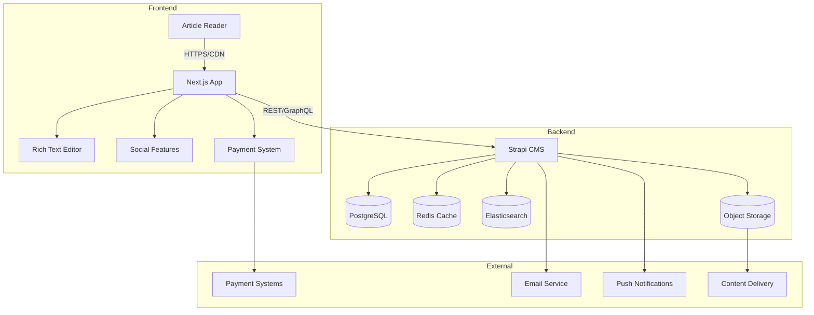

# Техническое задание «Блоговая платформа нового поколения»

## 1. Цель проекта
Создать современную блоговую платформу для русскоязычной аудитории с фокусом на качественный контент, справедливой монетизацией авторов и отсутствием навязчивой рекламы. Альтернатива VC.ru, Habr, Дзен с лучшим UX.

## 2. Ключевая ценность
1. **Качественный контент** без информационного мусора и навязчивой рекламы
2. **Справедливая монетизация** - авторы получают основную долю от подписок на их контент
3. **Отличный UX** для чтения и публикации контента
4. **Превосходное SEO** - топовые позиции в поисковиках
5. **Прозрачная аналитика** для авторов

## 3. Архитектурные принципы

### 3.1 Микромодульная архитектура
- **Один файл = одна ответственность** (максимум 50-100 строк)
- **Изолированные модули** без перекрёстных зависимостей
- **Типизированные интерфейсы** для всех модулей
- **Переиспользуемые компоненты** и утилиты
- **Лёгкое тестирование** каждого модуля отдельно

### 3.2 Структура модулей
```text
frontend/
├── components/          # UI компоненты
│   ├── editor/         # Редактор статей
│   ├── reader/         # Компоненты чтения
│   ├── social/         # Лайки, комментарии, подписки
│   └── monetization/   # Подписки, донаты
├── lib/                # Утилиты и API клиенты  
├── hooks/              # React хуки
├── types/              # TypeScript типы
└── app/                # Next.js страницы

backend/
├── api/                # Strapi API модули
│   ├── articles/       # Статьи и черновики
│   ├── authors/        # Авторы и их профили
│   ├── subscriptions/  # Подписки и платежи
│   ├── comments/       # Комментарии и модерация
│   └── analytics/      # Аналитика и статистика
├── utils/              # Утилиты
├── middlewares/        # Middleware функции
└── services/           # Бизнес-логика
```

## 4. Обновленный стек технологий

| Уровень | Технологии | Назначение | Изменения |
|---------|------------|------------|-----------|
| **Frontend** | Next.js 14 (App Router) | SSR/SSG для SEO, быстрая навигация | ✅ Оставляем |
| | TypeScript 5 | Типизация для больших проектов | ✅ Оставляем |
| | Tailwind CSS + DaisyUI | Современный UI блога | ✅ Оставляем |
| | **Новое: Tiptap Editor** | Rich text редактор для авторов | 🆕 Добавляем |
| | **Новое: Framer Motion** | Анимации для лучшего UX | 🆕 Добавляем |
| | @tanstack/react-query | Кэширование, состояние сервера | ✅ Оставляем |
| **Backend** | Strapi v5 | Headless CMS для блога | ✅ Адаптируем |
| | PostgreSQL 15 | Основная БД | ✅ Убираем PostGIS |
| | **Новое: Redis** | Кэширование, сессии, очереди | 🆕 Добавляем |
| | **Новое: Elasticsearch** | Полнотекстовый поиск по статьям | 🆕 Добавляем |
| | Yandex Object Storage | Медиафайлы статей | ✅ Оставляем |
| **Монетизация** | **ЮKassa / CloudPayments** | Подписки и донаты | 🆕 Добавляем |
| | **Новое: Stripe (международные)** | Зарубежные платежи | 🆕 Добавляем |
| **Уведомления** | **Новое: Pusher / WebSockets** | Real-time уведомления | 🆝 Добавляем |
| | **Новое: Mailgun / SendGrid** | Email рассылки | 🆕 Добавляем |
| **Analytics** | **Новое: Mixpanel** | Детальная аналитика | 🆕 Добавляем |
| | Yandex Metrica | Базовая аналитика | ✅ Оставляем |
| **Infrastructure** | Docker + docker-compose | Развёртывание | ✅ Оставляем |
| | Caddy / Nginx | Reverse proxy, SSL | ✅ Оставляем |
| | **Новое: CDN (BunnyCDN)** | Быстрая загрузка контента | 🆕 Добавляем |

## 5. Новая архитектура для блога



## 6. Микромодульная структура для блога

### 6.1 Структура Frontend (строго по принципам микромодулей)

```text
/components/
  /ui/                        # Базовые UI компоненты (атомарные)
  ├── Button/
  │   ├── Button.tsx         # Основной компонент
  │   ├── Button.types.ts    # TypeScript типы
  │   ├── Button.test.tsx    # Unit тесты
  │   └── index.ts           # Именованный экспорт
  ├── Input/
  │   ├── Input.tsx
  │   ├── Input.types.ts
  │   ├── Input.test.tsx
  │   └── index.ts
  └── Modal/
      ├── Modal.tsx
      ├── Modal.types.ts
      ├── Modal.test.tsx
      └── index.ts

  /forms/                     # Формы и валидация
  ├── ArticleForm/
  ├── CommentForm/
  ├── LoginForm/
  └── SubscriptionForm/

  /layout/                    # Layout компоненты
  ├── Header/
  ├── Footer/
  ├── Sidebar/
  └── PageLayout/

  /features/                  # Бизнес-логика компонентов
  ├── article-editor/         # Функциональность редактора
  │   ├── TiptapEditor/
  │   ├── ImageUploader/
  │   └── PublishSettings/
  ├── article-reader/         # Функциональность чтения
  │   ├── ArticleView/
  │   ├── ReadingProgress/
  │   └── RelatedArticles/
  ├── social-features/        # Социальный функционал
  │   ├── LikeButton/
  │   ├── CommentsSection/
  │   └── ShareButtons/
  └── monetization/           # Монетизация
      ├── SubscriptionCard/
      ├── PaywallModal/
      └── EarningsCard/

/lib/
  /api/                       # API клиенты
  ├── articles/
  │   ├── api.ts             # API функции
  │   ├── types.ts           # Типы данных
  │   ├── validation.ts      # Схемы валидации
  │   └── constants.ts       # Константы модуля
  ├── authors/
  ├── comments/
  └── subscriptions/

  /utils/                     # Утилитарные функции
  ├── formatting.ts
  ├── date.ts
  └── content.ts

  /validation/                # Схемы валидации (Zod)
  ├── article.validation.ts
  ├── comment.validation.ts
  └── user.validation.ts

  /constants/                 # Константы приложения
  ├── api.constants.ts
  ├── ui.constants.ts
  └── blog.constants.ts

/hooks/                       # React хуки
├── useArticles/
├── useComments/
└── useSubscriptions/

/types/                       # TypeScript типы
├── ArticleType.ts
├── AuthorType.ts
└── CommentType.ts

/store/                       # Состояние приложения
├── auth/
├── articles/
└── subscriptions/
```

### 6.2 API клиенты

```text
/lib/api/
  articles.ts                 # CRUD статей
  authors.ts                  # Авторы и профили
  comments.ts                 # Комментарии
  subscriptions.ts            # Подписки
  payments.ts                 # Платежи
  search.ts                   # Поиск контента
  analytics.ts                # Аналитика
  notifications.ts            # Уведомления
```

### 6.3 Утилиты

```text
/lib/utils/
  editor.ts                   # Утилиты редактора
  formatting.ts               # Форматирование текста/дат
  monetization.ts             # Расчёт доходов
  seo.ts                      # SEO метатеги
  analytics.ts                # Трекинг событий
  validation.ts               # Валидация форм
```

### 6.4 Хуки

```text
/hooks/
  useArticles.ts              # Работа со статьями
  useComments.ts              # Комментарии
  useSubscriptions.ts         # Подписки
  usePayments.ts              # Платежи
  useAnalytics.ts             # Аналитика
  useNotifications.ts         # Уведомления
  useSearch.ts                # Поиск
```

## 7. Backend структура (Strapi)

### 7.1 Content Types

```text
Article (Collection Type)
├── title                   string (required)
├── slug                    string (unique)
├── content                 rich text (Tiptap JSON)
├── excerpt                 text (автогенерация)
├── cover_image            media
├── author                 relation (User)
├── category               relation (Category)
├── tags                   relation many-to-many (Tag)
├── status                 enum (draft|published|premium)
├── is_featured            boolean
├── reading_time           integer (автоматически)
├── views_count            integer
├── likes_count            integer
├── comments_count         integer
├── published_at           datetime
└── seo_meta               component (SEOMeta)

Author (extends User)
├── user                   relation 1-1 (users-permissions_user)
├── display_name           string
├── bio                    text
├── avatar                 media
├── cover_image            media
├── social_links           json
├── is_verified            boolean
├── subscriber_count       integer
├── total_earnings         decimal
├── payment_info           json (encrypted)
└── analytics_settings     json

Subscription (Collection Type)
├── subscriber             relation (User)
├── author                 relation (User)
├── plan_type              enum (monthly|yearly)
├── price                  decimal
├── status                 enum (active|cancelled|expired)
├── started_at             datetime
└── expires_at             datetime

Comment (Collection Type)
├── content                text
├── author                 relation (User)
├── article                relation (Article)
├── parent                 relation (Comment) // для ответов
├── likes_count            integer
├── is_pinned              boolean
├── is_moderated           boolean
└── created_at             datetime
```

### 7.2 API модули

```text
/api/articles/
├── controllers/
│   ├── article.ts          # CRUD статей
│   ├── feed.ts            # Лента статей
│   ├── trending.ts        # Популярные статьи
│   └── recommendations.ts  # Рекомендации
├── services/
│   ├── content-processing.ts # Обработка контента
│   ├── seo-generation.ts     # Генерация SEO
│   ├── reading-time.ts       # Расчёт времени чтения
│   └── recommendations.ts    # Алгоритм рекомендаций

/api/monetization/
├── controllers/
│   ├── subscriptions.ts    # Управление подписками
│   ├── payments.ts         # Обработка платежей
│   └── earnings.ts         # Заработок авторов
├── services/
│   ├── payment-processing.ts # Интеграция с платёжками
│   ├── earnings-calculation.ts # Расчёт доходов
│   └── subscription-management.ts # Управление подписками
```

## 8. Ключевые отличия от оригинального стека

### Убираем:
- ❌ **PostGIS** - геолокация не нужна для блога
- ❌ **Сложная геопривязка** - заменяем на категории и теги

### Добавляем:
- 🆕 **Rich Text Editor (Tiptap)** - для качественного написания статей
- 🆕 **Elasticsearch** - мощный поиск по контенту
- 🆕 **Redis** - кэширование, сессии, очереди задач
- 🆕 **Система монетизации** - подписки, донаты, аналитика доходов
- 🆕 **Real-time уведомления** - комментарии, лайки, новые подписчики
- 🆕 **Email маркетинг** - рассылки, уведомления
- 🆕 **Продвинутая аналитика** - для авторов и платформы
- 🆕 **CDN** - быстрая доставка контента
- 🆕 **Антиспам и модерация** - качественная экосистема

## 9. SEO и производительность

### 9.1 SEO оптимизация
- **SSG для статей** - статичная генерация для лучшего SEO
- **Динамические мета-теги** - для каждой статьи
- **Structured Data** - разметка для поисковиков
- **XML Sitemap** - автогенерация карты сайта
- **AMP страницы** - для мобильных устройств (опционально)

### 9.2 Производительность
- **CDN для статики** - быстрая загрузка изображений
- **Image optimization** - WebP, размеры, lazy loading
- **Code splitting** - по роутам и компонентам
- **Caching strategy** - Redis + CDN + браузерный кэш
- **Database indexing** - для быстрого поиска

## 10. Монетизация и бизнес-модель

### 10.1 Модели подписок
- **Подписка на автора** (99-499₽/мес)
- **Премиум статьи** (19-99₽ за статью)
- **Платформенная подписка** (199₽/мес - без рекламы + бонусы)
- **Донаты авторам** (любая сумма)

### 10.2 Распределение доходов
- **70% автору** - основная доля
- **20% платформе** - развитие и поддержка
- **10% реферральная программа** - мотивация авторов

## 11. Нефункциональные требования

1. **Производительность**: время загрузки страницы ≤ 2 сек
2. **SEO**: индексация новых статей в течение 24 часов
3. **Доступность**: 99.9% uptime
4. **Безопасность**: защита от спама, модерация контента
5. **Масштабируемость**: поддержка 100К+ авторов, 1М+ читателей
6. **Соответствие 152-ФЗ**: хостинг в РФ, логирование

## 12. Принципы разработки микромодулей

### 12.1 Декомпозиция функций
- **Одна функция = одна задача**
- **Максимум 20 строк** на функцию
- **Чистые функции** где возможно (без побочных эффектов)
- **Явные зависимости** через параметры

### 12.2 Обязательные файлы в каждом модуле
```typescript
// Для компонентов:
Component.tsx           // Основной компонент
Component.types.ts      // TypeScript типы
Component.test.tsx      // Unit тесты  
index.ts               // Именованный экспорт

// Для API модулей:
api.ts                 // API функции
types.ts               // Типы данных
validation.ts          // Схемы валидации Zod
constants.ts           // Константы модуля
```

### 12.3 Правила импортов и экспортов
- **Абсолютные импорты** для внутренних модулей (`@/components/ui`)
- **Относительные импорты** только для соседних файлов (`./validation`)
- **Именованные экспорты** предпочтительнее default
- **Группировка импортов**: библиотеки → внутренние → относительные

### 12.4 Elegant Objects принципы (адаптированные для блога)
- **Immutable Data Structures** - все состояние неизменяемо
- **Композиция вместо наследования** - инжекция зависимостей через пропсы
- **Maybe<T> вместо null** - безопасная типизация
- **Интерфейсы для всех API** - явные контракты
- **Dependency Injection** - все зависимости через параметры

## 13. Инструменты разработки

### 13.1 Обязательные инструменты
- **ESLint** с правилами для микромодулей:
  ```json
  {
    "rules": {
      "max-lines": ["error", 100],
      "max-lines-per-function": ["error", 20], 
      "no-default-export": ["error"]
    }
  }
  ```
- **Prettier** для форматирования кода
- **TypeScript** в строгом режиме
- **Husky** для pre-commit хуков
- **Storybook** для документации UI компонентов

### 13.2 Генерация кода
```bash
npm run generate:component ArticleCard
npm run generate:api-client articles  
npm run generate:hook useArticles
npm run generate:validation article
```

### 13.3 Скрипты package.json
```json
{
  "scripts": {
    "lint": "eslint . --ext .ts,.tsx",
    "type-check": "tsc --noEmit", 
    "test": "jest",
    "test:watch": "jest --watch",
    "test:coverage": "jest --coverage",
    "build": "next build",
    "analyze": "npm run build && npx @next/bundle-analyzer",
    "storybook": "storybook dev -p 6006"
  }
}
```

## 14. Документация и тестирование

### 14.1 JSDoc для всех функций
```typescript
/**
 * Вычисляет время чтения статьи
 * @param content - текст статьи
 * @param wordsPerMinute - скорость чтения (по умолчанию 200)
 * @returns время чтения в минутах
 * @example
 * const time = calculateReadingTime(article.content, 250)
 */
export const calculateReadingTime = (
  content: string, 
  wordsPerMinute: number = 200
): number => {
  const wordCount = content.split(/\s+/).length;
  return Math.ceil(wordCount / wordsPerMinute);
};
```

### 14.2 Тестирование
- **Unit тесты** для каждого модуля
- **Integration тесты** для API
- **Component тесты** для UI
- **100% покрытие** критических модулей (монетизация, аутентификация)

## 15. Безопасность модулей

### 15.1 Принципы безопасности
- **Валидация** всех входящих данных (Zod схемы)
- **Санитизация** пользовательского контента (DOMPurify)
- **Rate limiting** для API (защита от спама)
- **Helmet** для безопасности заголовков
- **CORS** настройки для API

### 15.2 Инструменты
```typescript
// Валидация контента статьи
export const ArticleContentSchema = z.object({
  title: z.string().min(10).max(200),
  content: z.string().min(100),
  tags: z.array(z.string()).max(10)
});

// Санитизация HTML контента
export const sanitizeContent = (html: string): string => {
  return DOMPurify.sanitize(html, {
    ALLOWED_TAGS: ['p', 'h2', 'h3', 'strong', 'em', 'ul', 'ol', 'li'],
    ALLOWED_ATTR: ['href', 'title']
  });
};
```

## 16. Мониторинг и логирование

### 16.1 Структура логирования
```typescript
// logging/logger.ts - основной логгер
// logging/formatters.ts - форматирование логов  
// logging/transports.ts - транспорты логов
```

### 16.2 Уровни логирования
- **ERROR** - ошибки (платежи, критические сбои)
- **WARN** - предупреждения (медленные запросы)
- **INFO** - информация (новые статьи, регистрации)
- **DEBUG** - отладка (детальная аналитика)

## 17. Чеклист создания модуля

### ✅ Перед созданием:
- [ ] Определена единственная ответственность модуля
- [ ] Продуманы входы и выходы (TypeScript интерфейсы)
- [ ] Минимизированы зависимости от других модулей
- [ ] Выбрано правильное место в структуре проекта

### ✅ При создании:
- [ ] Размер файла < 100 строк кода
- [ ] Функции < 20 строк каждая
- [ ] Добавлены строгие TypeScript типы
- [ ] Написаны JSDoc комментарии для всех публичных функций
- [ ] Добавлена валидация входных данных (Zod схемы)
- [ ] Использованы именованные экспорты

### ✅ После создания:
- [ ] Написаны unit тесты (jest)
- [ ] Проверена интеграция с другими модулями
- [ ] Обновлена документация (README.md)
- [ ] Проведен code review
- [ ] Добавлен в Storybook (для UI компонентов)

## 18. Roadmap развития

| Этап | Функционал | Срок |
|------|------------|------|
| **MVP** | Публикация, чтение, базовая монетизация | 4-6 недель |
| **v1.0** | Комментарии, поиск, уведомления, аналитика | +4 недели |
| **v1.5** | Мобильное приложение, push уведомления | +6 недель |
| **v2.0** | ИИ-рекомендации, продвинутая аналитика | +8 недель |

---

**Принцип**: Микромодульность - это инструмент для создания поддерживаемого, тестируемого и масштабируемого кода. Каждый модуль решает одну задачу максимально просто и эффективно, что критически важно для работы с ИИ-ассистентами в разработке.
